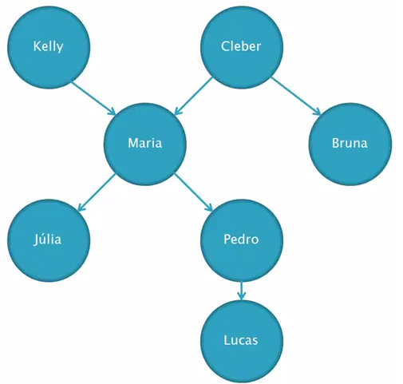

# Família
Para a base de dados família, irei mostrar alguns comandos para descobrir quem é pai de quem, quem é irmão ou até mesmo quem é avô e neto.

## Árvore Genealógica

### Pais
gerou(kelly, lucas).  
false.  
gerou(kelly, maria).  
true.  

### Buscar todos os filhos de um pai
gerou(cleber, X).  
X = maria ;  
X = bruna.  
É obrigatório que a constante "X" esteja escrito em maiuscula. Como essa consulta pode gerar vários resultados, click no ponto e virgula para ir mostrando todos os resultados da consulta.

### Buscar os pais de um filho
gerou(X, maria).  
X = kelly ;  
X = cleber.  

### Verificar se um é irmão do outro
gerou(X, julia), gerou(X, pedro).  
X = maria .  
No caso de uma dupla verificação que nem esse, a virgula é como se fosse o "AND" na programação, ou seja, para que um seja irmão do outro as duas preposições tem que ser verdadeiras.

### Buscar os avós de um neto
gerou(X, Y), gerou(Y, pedro).  
X = kelly ,  
Y = maria ;  
X = cleber ,  
y = maria .  
A Lógica para descobrir quem são os avós são assim: X -> Y -> pedro, ou seja, X gerou Y e Y gerou pedro. Logo os avós de pedro são todos os resultados de X.

